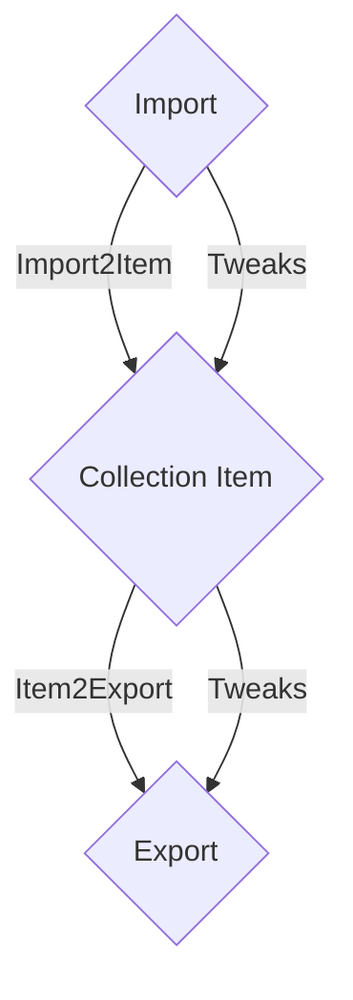

# Classify

Go Rest API and Angular 4 Website to classify all kind of numerical datas



## What is the purpose ?

* Collect all my datas in one document, store them in a specified directory and print them
* When I scan a document, store the data in the specified document
* Classify all my movies/musics searching through APIs

## How is it organised ?

* Collections: where are stored all validated datas
* Imports: where are from the datas (files, emails, scanner, websites ...)
* Exports: where are written/moved the datas (file, database, printer ...)
* Websites: search for more informations about the data to classify

## Getting Started

```
# To launch classify server
go run src/main.go

# To launch classify website
cd web
npm install
npm start
```

## How to develop

### Installation

```bash
# Install go
ln -s {path/to/classify}/src $GOPATH/src/github.com/ohohleo/classify
sudo apt-get install libmagick-dev libmagickwand-dev
go get github.com/ant0ine/go-json-rest/rest github.com/emersion/go-imap github.com/emersion/go-imap/client github.com/foize/go.fifo github.com/hydrogen18/stoppableListener github.com/jmoiron/sqlx github.com/mattn/go-sqlite3 github.com/quirkey/magick github.com/ryanbradynd05/go-tmdb golang.org/x/net/websocket

# Install nvm
curl -o- https://raw.githubusercontent.com/creationix/nvm/v0.33.8/install.sh | zsh
rehash
exec zsh
nvm install v8.10.0
nvm use v8.10.0

```

## Current API

```
GET /references
GET /stream

# Collections

POST   /collections
GET    /collections
GET    /collections/:name
GET    /collections/:name/config
PATCH  /collections/:name/config
PATCH  /collections/:name
DELETE /collections/:name

GET    /collections/:name/buffers
DELETE /collections/:name/buffers
GET    /collections/:name/buffers/:id
POST   /collections/:name/buffers/:id/validate
PATCH  /collections/:name/buffers/:id
DELETE /collections/:name/buffers/:id

GET    /collections/:name/items
DELETE /collections/:name/items
GET    /collections/:name/items/:id
PATCH  /collections/:name/items/:id
DELETE /collections/:name/items/:id

# Imports

POST   /imports
GET    /imports
GET    /imports/config
PUT    /imports/:import/start
PUT    /imports/:import/stop
DELETE /imports/:import

# Exports
```

## Authors

* **Léo Martin** - *Initial work* 2018